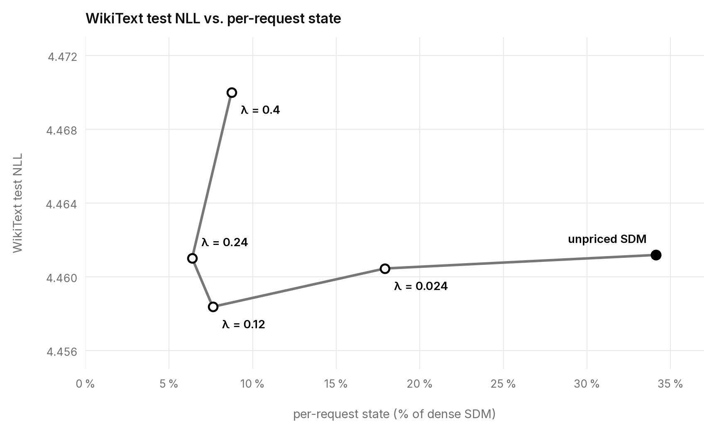
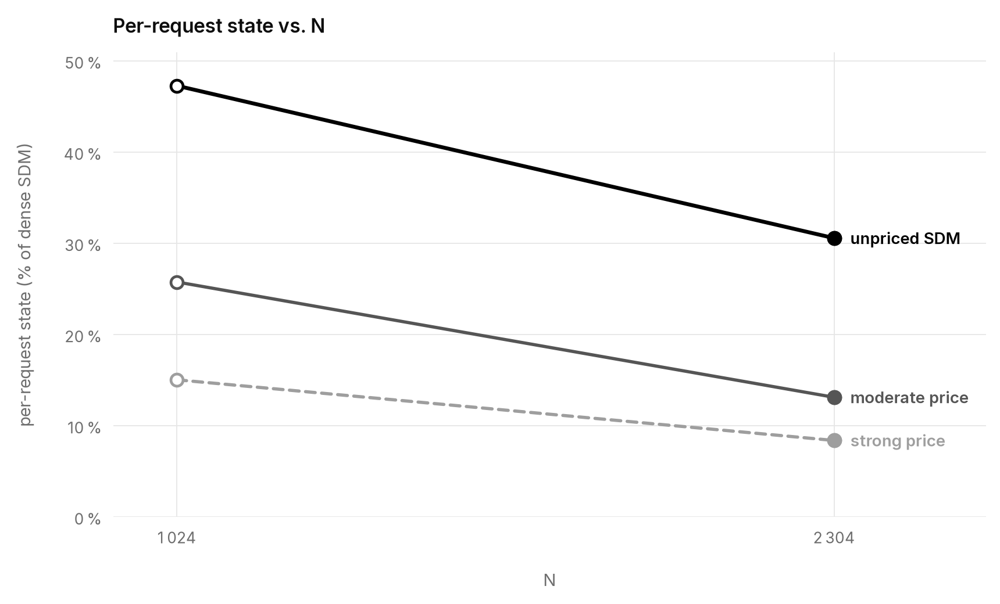

# Elastic SDM

## Intuition

Sparse Delta Memory (SDM) gives each recurrent layer a large logical table but
reads and writes only a few rows per token. [Copy-on-write
SDM](https://github.com/p0rc314in/copy-on-write-sdm) keeps an untouched row
shared and makes it private only on its first write.

In ordinary SDM, concentrating writes on fewer addresses over a request saves
neither compute nor memory: each token still makes the same sparse accesses,
and the full table is already private. Copy-on-write changes that. A first
write grows per-request state; rewriting an already-private row does not.

Elastic SDM gives the router a simple mixture-of-experts-style nudge toward
reuse: first writes have a price, while rewrites do not. The complete logical
table remains available when needed, but the model can learn to keep each
request's private working set small.

## Construction

SDM routing, recurrence, and inference are unchanged. Training adds one term:

```text
task loss + λ × unique written rows / logical rows
```

Here λ is the price on first-touch occupancy. The forward term counts the exact
union of hard top-W write addresses. A straight-through noisy-OR surrogate
supplies the router gradient: selected write mass is cheaper on a row that also
receives mass elsewhere in the sequence. The auxiliary term disappears at
inference, and λ = 0 is unpriced SDM.

The fixed-reserve experiments use one SDM memory head, N = 1 024, balanced
R = W = 16 access, and seven SDM layers followed by one attention layer. The
capacity scan later increases N while preserving the rest of this shape.

## Result

### A first-touch price makes a fixed reserve sparser

The same five λ values were tested on two complementary tasks. WikiText-103 is
the ordinary language-modeling check: each arm trains for three complete
corpus passes without replacement, then scores every held-out transition.
Adaptive recall is the retrieval canary: exact-set accuracy requires every
answer in an example to be correct and exposes retrieval failures that
aggregate language loss can hide.

For WikiText, private rows as a percentage of unpriced SDM measure the effect
of the price. Per-request state as a percentage of dense SDM measures the
resulting footprint, including both the private overlay and direct map.

| λ | WikiText test NLL | Private rows (% of unpriced) | Per-request state (% of dense SDM) | Recall exact-set accuracy |
|---:|---:|---:|---:|---:|
| 0 | 4.46119 | 100 % | 34.13 % | 56.64 % |
| 0.024 | 4.46045 | 51.35 % | 17.91 % | 57.70 % |
| 0.12 | 4.45838 | 20.49 % | 7.61 % | 57.34 % |
| 0.24 | 4.46101 | 16.79 % | 6.38 % | 54.04 % |
| 0.40 | 4.47001 | 23.85 % | 8.74 % | 52.57 % |

At λ = 0.12, WikiText uses 20.49 % as many private rows as unpriced SDM and
test NLL is 0.00281 lower. Including the direct map, its per-request state is
7.61 % of dense SDM. WikiText still tolerates λ = 0.24, reaching 6.38 % of
dense state with test NLL effectively unchanged, but the recall canary has
begun losing exact answers. At λ = 0.40, state rises to 8.74 % of dense SDM,
WikiText test NLL rises by 0.00882, and recall degrades further. The shared
quality region therefore extends through λ = 0.12 in this sweep.



### A larger logical reserve remains sparse

The second experiment measures how first-touch pricing changes private-state
growth as the logical reserve expands. It increases N from 1 024 to 2 304
(2.25×) and compares unpriced SDM with two priced operating points. The nonzero
pairs hold λ/N fixed, the objective coefficient on the reported mean private
rows per bank.

Increasing N also raises trainable parameters from 2.61 M to 3.81 M, mostly
through learned initial memory. Those extra parameters may explain the higher
exact-set accuracy at N = 2 304, so this experiment does not treat that accuracy
gain as a capacity result. It tests how private rows grow under matched
mean-row coefficients.

| Setting | λ, 1 024 → 2 304 | Private-row growth | Per-request state (% of dense SDM), 1 024 → 2 304 | Exact-set accuracy, 1 024 → 2 304 |
|---|---:|---:|---:|---:|
| Unpriced SDM | 0 → 0 | +44.18 % | 47.31 % → 30.60 % | 56.64 % → 59.23 % |
| Moderate | 0.024 → 0.054 | **+11.23 %** | 25.79 % → 13.14 % | 57.70 % → 59.32 % |
| Strong | 0.12 → 0.27 | **+20.16 %** | 15.06 % → 8.41 % | 57.34 % → 58.94 % |



Logical capacity reaches 225 % of its original size. Unpriced private rows grow
by 44.18 %, while the two priced working sets grow by only 11.23 % and 20.16 %.
Their per-request share of dense SDM falls from 25.79 % to 13.14 % and from
15.06 % to 8.41 %, respectively.

## Why it matters

Copy-on-write makes untouched SDM rows shareable, and first-touch pricing keeps
each private working set sparse. Together, they loosen the link between logical
capacity and per-request memory. In this scan, increasing N to 2.25× its
original size increased the priced private working sets by only 11.23–20.16 %.
At N = 2 304, those configurations use only 8.41–13.14 % as much per-request
state as dense SDM. The direct map and remaining private rows still grow, but
SDM can expose substantially more logical memory without requiring per-request
state to grow in proportion.

Across these matched seed-0 runs, λ traces a workload-dependent memory
frontier.

## Reproduction

The repository contains thirteen unique decision-bearing arms: five WikiText
prices, the same five N = 1 024 recall prices, and three additional N = 2 304
recall arms:

```bash
uv sync --frozen
uv run --no-sync ./reproduce.sh all
```

See [REPRODUCING.md](REPRODUCING.md) for data checksums, hardware, expected
runtime and cost, output locations, and metric ranges. Exact definitions and
settings are in [APPENDIX.md](APPENDIX.md); machine-readable provenance is in
[provenance.json](provenance.json).

## References

- Loïc Cabannes et al., [Sparse Delta Memory: Scaling the State of Linear RNNs through Sparsity](https://arxiv.org/abs/2607.07386), 2026.
- Stephen Merity et al., [Pointer Sentinel Mixture Models](https://arxiv.org/abs/1609.07843), 2016.
